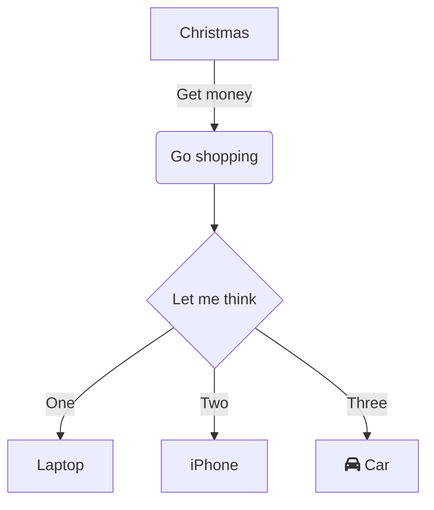

## Title Level 2

Some text, is good. Lorem ipsum. Interesting.

Let's put some code here:

<br/>

This is the entry point. The first component, `App`<swm-token data-swm-token=":src/App.tsx:7:2:2:`function App() {`"/>. Here, we put every provider as a wrapper for the `App`<swm-token data-swm-token=":src/App.tsx:7:2:2:`function App() {`"/> component.
<!-- NOTE-swimm-snippet: the lines below link your snippet to Swimm -->
### 📄 src/App.tsx
```tsx
7      function App() {
8        return (
9          <QueryClientProvider client={queryClient}>
10           <EditContextProvider>
11             <RouterProvider router={router} />
12           </EditContextProvider>
13         </QueryClientProvider>
14       )
15     }
```

<br/>

[[sym-mention:(124f6e96-5fbc-498c-a39a-5fdfb586932d|2bWN0)Renato Melo]]

### Title Level 3

`useImage`<swm-token data-swm-token=":src/hooks/useImage.tsx:6:2:2:`const useImage = (props: ImageProps) =&gt; {`"/> hook for handling images: `📄 src/hooks/useImage.tsx`

## Title Level 2 again

<br/>

<div align="center"></div>

<br/>

## Title 2

[todo/🤓 Smart text](https://app.swimm.io/repos/dummy-repo/docs/fpz6g)

<br/>

<!--MERMAID {width:100}-->

<!--MCONTENT {content: "graph TD<br/>\nA\\[Christmas\\] \\-\\-\\>|Get money| B(Go shopping)<br/>\nB \\-\\-\\> C{Let me think}<br/>\nC \\-\\-\\>|One| D\\[Laptop\\]<br/>\nC \\-\\-\\>|Two| E\\[iPhone\\]<br/>\nC \\-\\-\\>|Three| F\\[fa:fa-car Car\\]<br/>\n\n<br/>"} --->

<br/>

<br/>

<br/>

This file was generated by Swimm. [Click here to view it in the app](https://app.swimm.io/repos/Z2l0aHViJTNBJTNBbWlzc2N1cGNha2UtY2xpZW50JTNBJTNBcmVuYXRvYW0=/docs/4eklbrqs).
